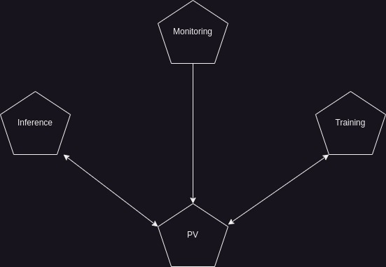

# ML Pipeline with K8S

### Pods

1. Training ---> having access to a PV it must perform the training of the models (preprocessing-training-test-release of the models) and logging the events
2. Inference --> web api exposed to the external which have to manage the requests and performing the inferences, plus logging its events
3. Monitoring --> Guess what? It have to monitoring the application. Having access to the same PV, it can read the logs written by the Training/Inference pods and expose it to the external (this part should be managed as an event-driven app in which some critical events can trigger some actions)

N.B: this is just an experimental repository, it does not follow the best pratice to separete the code repository by the infrastructure (k8s manifests) repository. Use it just for quickly testing your idea. 